# Blog Automation System - Architecture Diagrams

## System Overview

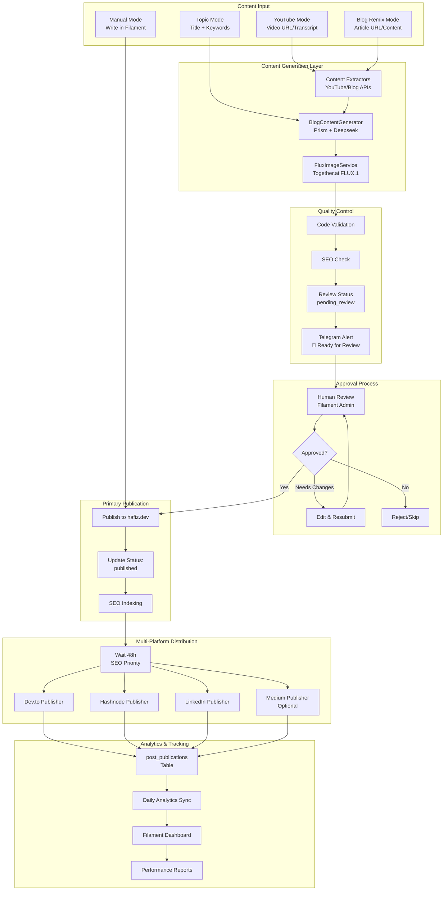

---

## Database Schema

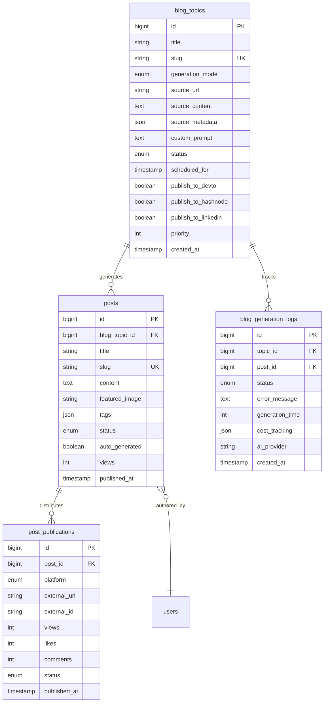

---

## Content Generation Flow

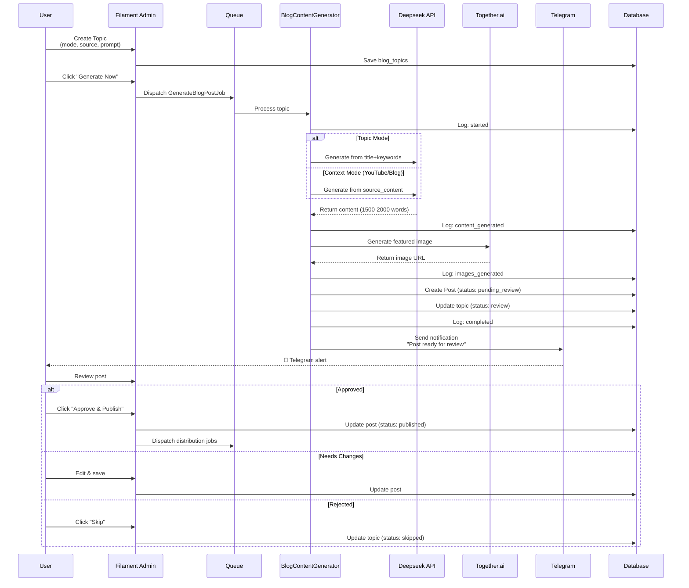

---

## Multi-Platform Distribution Flow

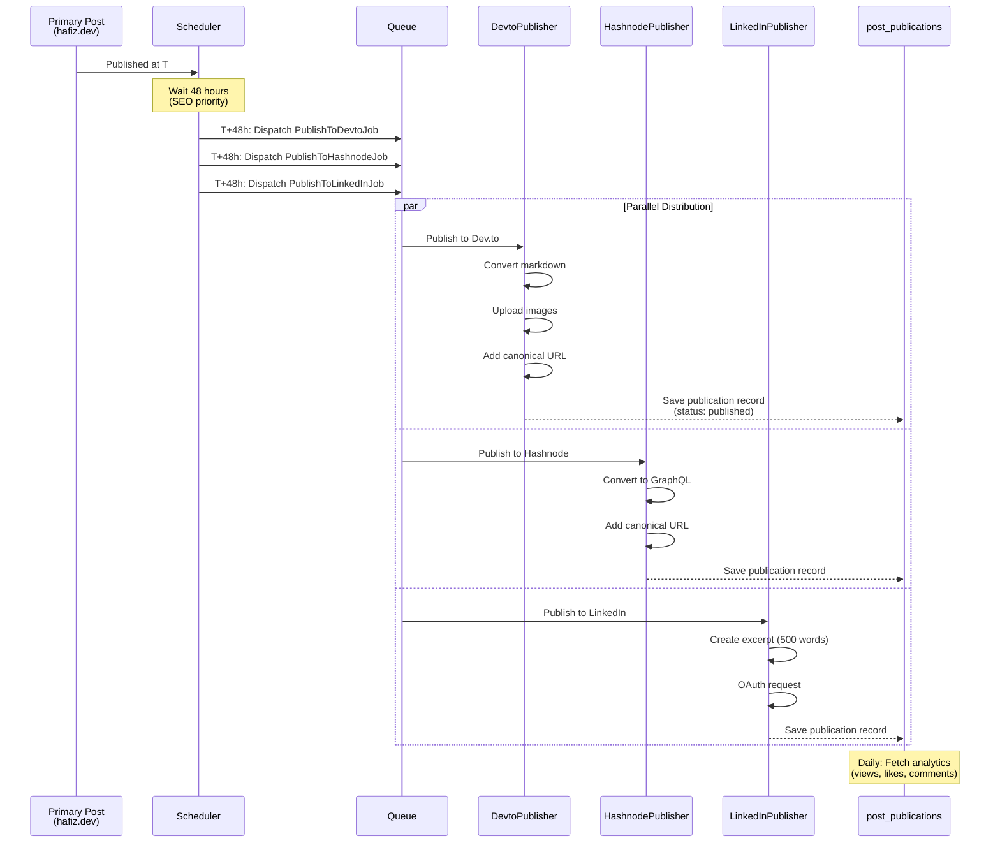

---

## Topic Generation Modes

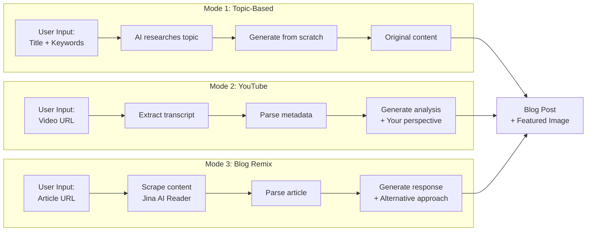

---

## Review Workflow States

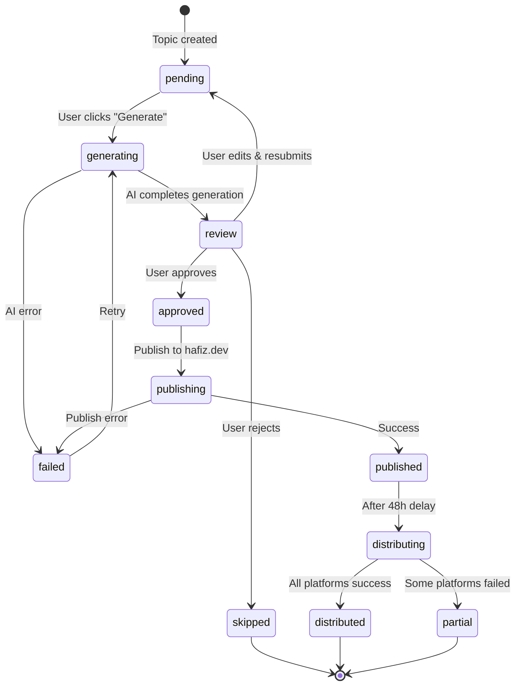

---

## Cost Breakdown Per Post

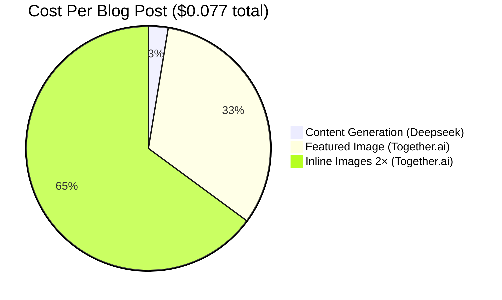

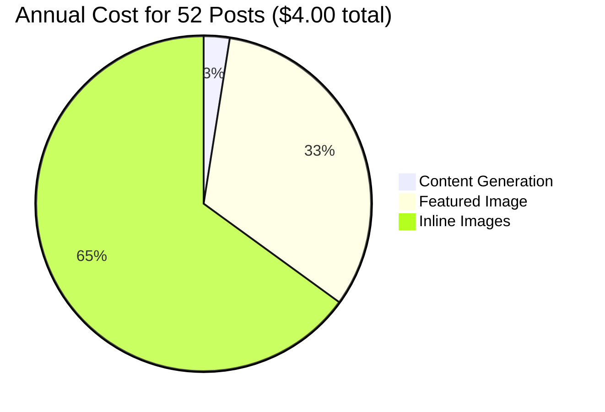

---

## Platform Publishing Timeline

```mermaid
gantt
    title Multi-Platform Publishing Schedule
    dateFormat HH:mm
    axisFormat %H:%M

    section Primary
    Publish to hafiz.dev :done, p1, 00:00, 1m
    SEO Indexing :active, p2, after p1, 2880m

    section Secondary
    Wait 48h :crit, w1, after p1, 2880m
    Publish to Dev.to :d1, after w1, 5m
    Publish to Hashnode :h1, after w1, 5m
    Publish to LinkedIn :l1, after w1, 5m

    section Analytics
    Daily Sync :a1, after d1, 1440m
```

---

## Error Handling Flow

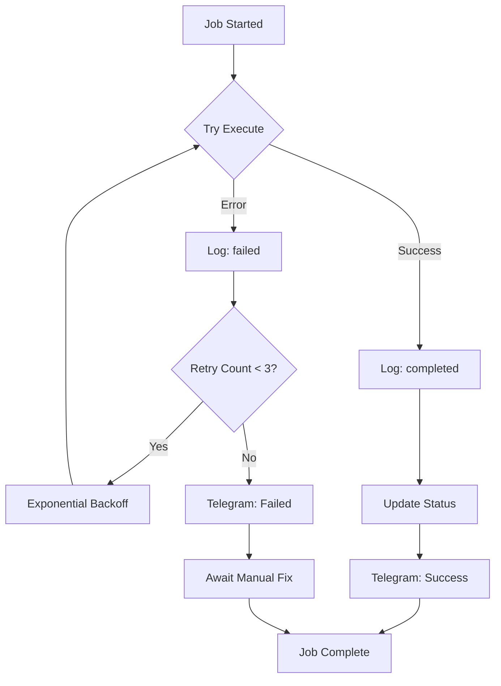

---

## Analytics Dashboard Layout

```
┌─────────────────────────────────────────────────────────────┐
│                  Blog Analytics Dashboard                    │
├─────────────────────────────────────────────────────────────┤
│                                                              │
│  ┌──────────────┐  ┌──────────────┐  ┌──────────────┐     │
│  │ Total Posts  │  │ Total Views  │  │ Total Leads  │     │
│  │     52       │  │    1,234     │  │      5       │     │
│  └──────────────┘  └──────────────┘  └──────────────┘     │
│                                                              │
│  ┌────────────────────────────────────────────────────┐    │
│  │ Performance by Platform                             │    │
│  ├────────────────────────────────────────────────────┤    │
│  │ hafiz.dev    ████████████ 450 views  (36%)        │    │
│  │ Dev.to       ██████████   350 views  (28%)        │    │
│  │ Hashnode     ███████      250 views  (20%)        │    │
│  │ LinkedIn     ████         184 views  (16%)        │    │
│  └────────────────────────────────────────────────────┘    │
│                                                              │
│  ┌────────────────────────────────────────────────────┐    │
│  │ Top Performing Posts                                │    │
│  ├────────────────────────────────────────────────────┤    │
│  │ 1. Laravel Multi-Tenancy Guide      234 views     │    │
│  │ 2. Automated Chrome Extension CI    198 views     │    │
│  │ 3. Building SaaS with Filament      176 views     │    │
│  └────────────────────────────────────────────────────┘    │
│                                                              │
│  ┌────────────────────────────────────────────────────┐    │
│  │ Generation Statistics                               │    │
│  ├────────────────────────────────────────────────────┤    │
│  │ Avg Generation Time: 90s                           │    │
│  │ Success Rate: 98%                                  │    │
│  │ Rejection Rate: 5%                                 │    │
│  │ Total Cost: $3.85 / $4.00 budget                   │    │
│  └────────────────────────────────────────────────────┘    │
│                                                              │
└─────────────────────────────────────────────────────────────┘
```

---

## Deployment Architecture

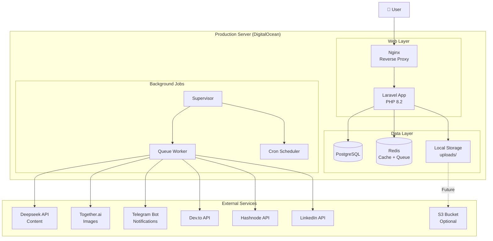

---

## Development Timeline

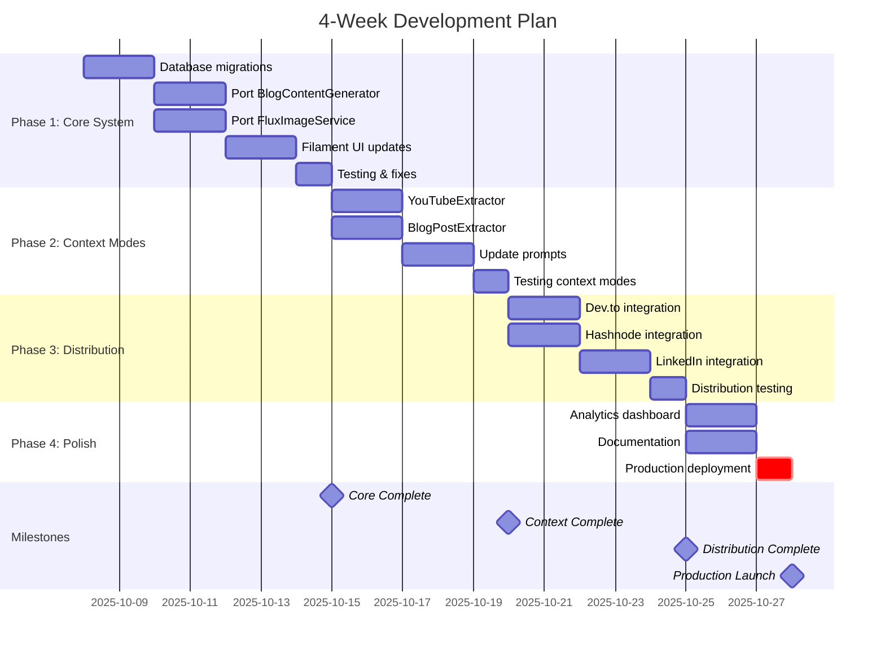

---

**Document Version**: 1.0
**Last Updated**: October 8, 2025
**Status**: Planning Complete
